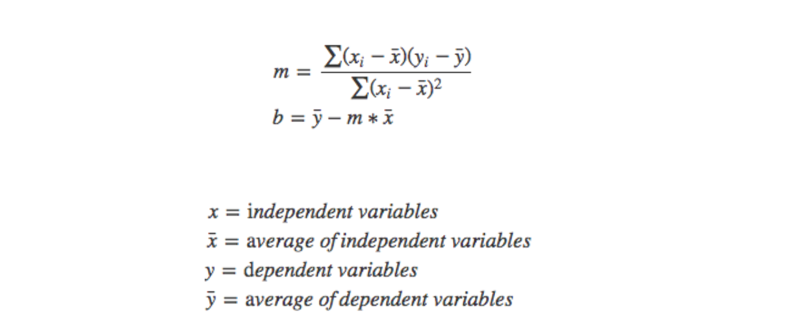

## Gradient Descent vs OLSS

The reasons are:

1. For most nonlinear regression problems there is no closed form solution.

2. Even in linear regression (one of the few cases where a closed form solution is available), it may be impractical to use the formula. The following example shows one way in which this can happen.

You should provide more details about yout problem - what exactly are you asking about - are we talking about linear regression in one or many dimensions? Simple or generalized ones?

In general, why do people use the GD?

it is easy to implement
it is very generic optimization technique - even if you change your model to the more general one, you can stil use it
So what about analytical solutions? Well, we do use them, your claim is simply false here (if we are talking in general), for example the OLS method is a closed form, analytical solution, which is widely used. If you can use the analytical solution, it is affordable computationaly (as sometimes GD is simply cheapier or faster) then you can, and even should - use it.

Neverlethles this is always a matter of some pros and cons - analytical solutions are strongly connected to the model, so implementing them can be inefficient if you plan to generalize/change your models in the future. They are sometimes less efficient then their numerical approximations, and sometimes there are simply harder to implement. If none of above is true - you should use the analytical solution, and people do it, really.

To sum up, you rather use GD over analytical solution if:

* you are considering changes in the model, generalizations, adding some more complex terms/regularization/modifications
* you need a generic method because you do not know much about the future of the code and the model (you are only one of the developers)
* analytical solution is more expensive computationaly, and you need efficiency
* analytical solution requires more memory, which you do not have
* analytical solution is hard to implement and you need easy, simple code

### Linear regression - LMS with gradient descent vs normal equations

**I wonder when to use linear regression with stochastic or batch gradient descent to minimize the cost function vs when to use normal equations? The algorithms using gradient descent are iterative, so they might take more time to run, as opposed to the normal equation solution, which is a closed form equation. But it does use matrices to store the training data. Does this mean gradient solutions require more processing power, but using the normal equation method requires more memory because of the matrices? Which method is optimal in what scenario?**

Andrew Ng answers this question succinctly in his [Coursera lecture about the normal equation](https://www.coursera.org/learn/machine-learning/lecture/2DKxQ/normal-equation%22%22). I will summarize.

You have <code>m training examples</code> and <code>n features</code>.

###  Disadvantages of gradient descent:

* you need to choose the learning rate, so you may need to run the algorithm at least a few times to figure that out.
* it needs many more iterations, so, that could make it slower

### Compared to the normal equation:

* you don't need to choose any learning rate
* you don't need to iterate
### Disadvantages of the normal equation:

* Normal Equation is computationally expensive when you have a very large number of features ( n features ), because you will ultimately need to take the inverse of a n x n matrix in order to solve for the parameters data.

### Compared to gradient descent:

* it will be reasonably efficient and will do something acceptable when you have a very large number ( millions ) of features.

### So if :-
* If n is large then use gradient descent.
* If n is relatively small ( on the order of a hundred ~ ten thousand ), then the normal equation

[stackexchange](https://datascience.stackexchange.com/questions/14118/linear-regression-lms-with-gradient-descent-vs-normal-equations/14119)

When you use the normal equations for solving the cost function analytically you have to compute:

β=(X′X)−1X′Y

Where X is your matrix of input observations and y your output vector. The problem with this operation is the time complexity of calculating the inverse of a nxn matrix which is O(n^3) and as n increases it can take a very long time to finish.

When n is low (n < 1000 or n < 10000) you can think of normal equations as the better option for calculation theta, however for greater values Gradient Descent is much more faster, so the only reason is the time :)

https://stackoverflow.com/questions/18191890/why-gradient-descent-when-we-can-solve-linear-regression-analytically

https://stats.stackexchange.com/questions/278755/why-use-gradient-descent-for-linear-regression-when-a-closed-form-math-solution

https://towardsdatascience.com/linear-regression-simplified-ordinary-least-square-vs-gradient-descent-48145de2cf76
